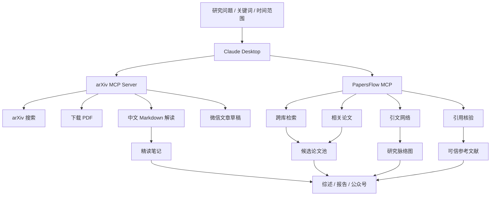

# Claude Desktop 论文工作流：arXiv MCP + PapersFlow MCP

面向中文科研阅读、文献综述、引用核验和论文追踪的 Claude Desktop 工作流。核心思路是把两个 MCP 工具分工使用：

- `arXiv MCP Server`：负责 arXiv 论文搜索、PDF 下载、英文论文转中文 Markdown、微信公众号草稿。
- `PapersFlow MCP`：负责跨数据库文献检索、引用核验、相关论文发现、引文网络探索。

> 核对日期：2026-04-23。MCP 客户端和第三方服务更新很快，正式发布前建议再跑一次安装命令检查。

## 这是什么 / 不是什么

这份仓库是：

- 一个面向 `Claude Desktop` 的论文工作流说明。
- 一个把 `本地 arXiv MCP` 和 `远程 PapersFlow MCP` 分工接入的最小实践。
- 一个适合直接发到 GitHub 的中文说明模板。

这份仓库不是：

- 不是完整的 `Claude Code CLI` 教程。
- 不是一个把所有论文工具都塞进来的“大而全”导航页。
- 不是对第三方 MCP Server 的功能背书，正式研究仍要回原文核验。

## 适用场景

- 追踪某个方向最近 1 到 6 个月的新论文。
- 快速把英文 arXiv PDF 转成中文精读笔记。
- 做系统性文献综述，整理研究脉络、代表论文和空白点。
- 核验参考文献是否真实存在，降低幻觉引用风险。
- 把论文精读笔记改写成公众号、组会汇报或项目调研材料。

## 支持矩阵

| 组合 | 推荐方式 | 状态 | 说明 |
| --- | --- | --- | --- |
| Claude Desktop + `arXiv MCP Server` | 本地 MCP 配置文件或本地扩展 | 推荐 | 适合本地下载 PDF、转中文 Markdown、生成微信稿 |
| Claude Desktop + `PapersFlow MCP` | 自定义远程 Connector UI | 推荐 | 适合文献检索、引用核验、引文网络；不是改本地 JSON |
| Claude Code + `PapersFlow MCP` | `claude mcp add --transport http ...` | 可选 | 命令行用法，别和 Claude Desktop 混写 |

## Windows 快速开始

如果你只想先跑通一版，按这一条路径走：

1. 安装 Claude Desktop。
2. 安装 Node.js，确认 `node -v` 和 `npm -v` 可用。
3. 新建 `C:\Users\你的用户名\Documents\ClaudePapers`。
4. 在 Claude Desktop 的本地 MCP 配置里加入 `arxiv-mcp-server`。
5. 在 Claude Desktop 的远程 Connector UI 里添加 `https://doxa.papersflow.ai/mcp`。
6. 重启 Claude Desktop，新开一个对话，确认两个工具都能被调用。

## 总体流程



## 工具分工

| 工具 | 最适合做什么 | 不建议只靠它做什么 |
| --- | --- | --- |
| `arXiv MCP Server` | 预印本搜索、PDF 下载、中文精读、微信公众号草稿 | 不适合单独完成跨数据库综述和引用真实性核验 |
| `PapersFlow MCP` | OpenAlex / Semantic Scholar / arXiv 等学术检索、相关论文、引文网络、引用核验 | 不负责把某篇 PDF 本地下载后转成完整中文笔记 |
| Claude Desktop | 对话式调度、综合判断、生成报告 | 不应凭记忆生成未经核验的参考文献 |

## 安装前准备

1. 安装最新版 Claude Desktop。
2. 准备 Node.js 18 或更高版本。Windows 上建议先确认 `node -v` 和 `npm -v` 可用。
3. 为论文输出单独建一个目录，例如 `C:\Users\你的用户名\Documents\ClaudePapers`。
4. 如果使用 `arXiv MCP Server` 的中文解读功能，需要申请 `SiliconFlow API Key`。
5. 不要把真实 API Key、下载的 PDF、生成的论文笔记提交到公开 GitHub 仓库。

## 一、配置 arXiv MCP Server

`arXiv MCP Server` 是本地 stdio MCP Server，适合放进 Claude Desktop 的本地 MCP 配置。

### 推荐配置方式：Claude Desktop 本地 MCP

Claude Desktop 支持通过桌面扩展安装本地 MCP，也可以继续使用本地配置文件。新手优先看 Claude Desktop 的 `Settings > Extensions` 和 `Settings > Developer`；如果你要手动配置，Windows 路径通常是：

```powershell
$env:APPDATA\Claude\claude_desktop_config.json
```

把下面内容合并进 `claude_desktop_config.json`。如果文件已经存在，只合并 `mcpServers` 里的新增项，不要覆盖原有服务器。

```json
{
  "mcpServers": {
    "arxiv-mcp-server": {
      "command": "cmd",
      "args": ["/c", "npx", "-y", "@langgpt/arxiv-mcp-server@latest"],
      "env": {
        "SILICONFLOW_API_KEY": "replace_with_your_siliconflow_key",
        "WORK_DIR": "C:\\Users\\YOUR_NAME\\Documents\\ClaudePapers"
      }
    }
  }
}
```

macOS / Linux 通常可写成：

```json
{
  "mcpServers": {
    "arxiv-mcp-server": {
      "command": "npx",
      "args": ["-y", "@langgpt/arxiv-mcp-server@latest"],
      "env": {
        "SILICONFLOW_API_KEY": "replace_with_your_siliconflow_key",
        "WORK_DIR": "/Users/YOUR_NAME/Documents/ClaudePapers"
      }
    }
  }
}
```

配置后重启 Claude Desktop，在聊天框的 `+` 或 `Connectors` 里确认 `arxiv-mcp-server` 已连接。

### 可用工具

| 工具名 | 用途 |
| --- | --- |
| `search_arxiv` | 关键词检索 arXiv 论文 |
| `download_arxiv_pdf` | 根据 arXiv ID 或 URL 下载 PDF |
| `parse_pdf_to_markdown` | 把 PDF 解析为中文 Markdown |
| `convert_to_wechat_article` | 生成微信公众号文章草稿 |
| `process_arxiv_paper` | 下载、解析、可选生成微信稿的一站式流程 |
| `clear_workdir` | 清空工作目录，慎用 |

## 二、配置 PapersFlow MCP

`PapersFlow MCP` 是远程 HTTP MCP Server，入口地址：

```text
https://doxa.papersflow.ai/mcp
```

### Claude Desktop / claude.ai：推荐用自定义连接器

对于远程 MCP，Claude Desktop 和 claude.ai 的推荐路径是 `Customize > Connectors > Add custom connector`，填入上面的 MCP URL。注意远程连接器是由 Anthropic 云端发起连接，不等同于本机 `claude_desktop_config.json` 里的本地 MCP。

如果你的 Claude 账号或组织没有开放自定义连接器入口，可以先在 Claude Code、Codex、Cursor、Gemini CLI 等支持远程 HTTP MCP 的客户端中使用 PapersFlow。

如果 Claude 弹出登录或授权页面，按其流程完成即可。不要把 `ANTHROPIC_API_KEY`、`SiliconFlow API Key` 和任何第三方令牌混为一谈。

### Claude Code：命令行配置

新版 Claude Code 官方文档推荐远程 MCP 使用 `http` transport：

```powershell
claude mcp add --transport http papersflow https://doxa.papersflow.ai/mcp
```

如果你参考的 PapersFlow 旧教程使用 `--transport streamable-http`，而你的 Claude Code CLI 仍支持该写法，也可以按其教程执行。两者核心都是连接同一个远程 MCP URL。

### 可用公共工具

| 工具名 | 用途 |
| --- | --- |
| `search` | 通用学术搜索 |
| `fetch` | 按 DOI、标题或 URL 获取论文元数据 |
| `search_literature` | 带过滤条件的文献检索 |
| `verify_citation` | 标准化并核验引用 |
| `find_related_papers` | 查找相关论文 |
| `get_citation_graph` | 构建某篇论文的引用网络 |
| `get_paper_neighbors` | 查找引文网络邻近论文 |
| `expand_citation_graph` | 多跳扩展引文网络 |

## 三、推荐论文工作流

### 1. 先把问题收窄

不要一上来就说“帮我找扩散模型论文”。先让 Claude 把主题拆成可执行检索协议：

```text
我想研究“扩散模型在视频生成中的高效推理”。
请先不要检索，先帮我把这个主题拆成：
1. 关键词和同义词；
2. arXiv / OpenAlex / Semantic Scholar 适合的检索式；
3. 时间范围，默认 2024-01 至今；
4. 纳入标准和排除标准；
5. 最终输出表格字段。
```

### 2. 用 PapersFlow 建候选论文池

```text
请调用 PapersFlow MCP，围绕“large language model reasoning ability”做系统性文献检索。
要求：
1. 优先 2023 年以后论文；
2. 每条结果给出标题、作者、年份、venue/arXiv、DOI/arXiv ID、引用数、为什么相关；
3. 按“推理数据集”“推理过程监督”“工具增强推理”“搜索/验证器”“评测基准”分类；
4. 先返回 30 篇候选论文，不要编造缺失字段。
```

### 3. 用 arXiv MCP 深读核心论文

```text
请调用 arXiv MCP 处理这篇论文：[粘贴 arXiv 链接或 ID]。
输出中文 Markdown 精读笔记，结构如下：
1. 论文解决的问题；
2. 方法核心图解；
3. 与前作相比的真实创新点；
4. 实验设置和关键指标；
5. 失败案例和局限；
6. 我应该继续读的 5 篇相关论文。
```

### 4. 用 PapersFlow 做引文网络和空白点

```text
请以这 3 篇核心论文为种子，调用 PapersFlow MCP 扩展一跳和二跳引文网络。
请输出：
1. 每篇种子论文的关键前驱论文；
2. 被多篇论文共同引用的基础工作；
3. 近两年新出现但引用还不高的潜力论文；
4. 研究空白，必须对应到具体证据，不要泛泛而谈。
```

### 5. 引用核验后再写综述

```text
下面是我准备放进综述的参考文献列表。
请调用 PapersFlow 的 verify_citation 逐条核验：
1. 是否真实存在；
2. 标题、作者、年份、venue 是否匹配；
3. DOI/arXiv ID 是否可解析；
4. 标记为 verified / ambiguous / not_found；
5. 对 ambiguous 和 not_found 给出修正建议。
```

### 6. 输出最终综述

```text
请基于已核验论文写一份中文文献综述。
要求：
1. 不引用未核验论文；
2. 每个结论后面标注对应论文；
3. 按时间线和方法线双重组织；
4. 单独列出“已有共识”“仍有争议”“可做的新方向”；
5. 最后给出 BibTeX 或 DOI/arXiv ID 列表。
```

## 四、产出模板

建议让 Claude 每次输出都使用这个表格，方便后续复制进 Excel、Notion 或综述草稿。

| 字段 | 说明 |
| --- | --- |
| `paper_id` | DOI、arXiv ID 或 PapersFlow 返回 ID |
| `title` | 论文标题 |
| `year` | 年份 |
| `venue` | 会议、期刊或 arXiv |
| `task` | 解决什么任务 |
| `method` | 方法关键词 |
| `evidence` | 实验或结论证据 |
| `limitation` | 局限 |
| `why_read` | 为什么值得读 |
| `citation_status` | `verified` / `ambiguous` / `not_found` |

## 五、验证是否真的接通

配置完不要立刻去写综述，先做最小验证。

### 验证 1：arXiv MCP 是否可用

```text
请调用 arXiv MCP 搜索 “test-time scaling reasoning” 相关论文，返回 3 篇结果。
```

预期结果：Claude 明确显示调用了 `search_arxiv` 或等价工具，并返回 arXiv 结果。

### 验证 2：PapersFlow 是否可用

```text
请调用 PapersFlow 搜索 “diffusion models video generation efficiency”，只返回 5 篇。
```

预期结果：Claude 明确显示调用了 PapersFlow 的检索工具，而不是直接凭记忆回答。

### 验证 3：引用核验是否可用

```text
请调用 PapersFlow verify_citation，核验 “Attention Is All You Need, 2017, Vaswani et al.”。
```

预期结果：返回标准化后的文献信息和核验状态。

## 六、常见坑

- 不要把 `claude mcp add ...` 直接当成 Claude Desktop 的 JSON 配置。它主要是 Claude Code CLI 的命令。
- 不要给 Claude Desktop 额外写一个 `papersflow` 本地 JSON 配置，远程 Connector 不是这么接的。
- Windows 上 Claude Desktop 启动 `npx` 偶尔找不到可执行文件，优先用 `command: "cmd"` 和 `args: ["/c", "npx", ...]`。
- `WORK_DIR` 要写到你有权限的目录，路径中的反斜杠在 JSON 里要写成 `\\`。
- `clear_workdir` 会清空 arXiv MCP 的工作目录，不要把 `WORK_DIR` 指向重要文件夹。
- 远程 MCP 连接器由云端访问 MCP URL，本地内网地址不能直接用于 Claude 远程连接器。
- 远程 MCP 现在优先按 `http` transport 理解，不要继续拿过时的 SSE 示例当主路径。
- 论文摘要、中文解读和公众号稿都只是辅助材料，正式写作前必须回到原文和引用核验结果。
- 公开 GitHub 仓库不要提交 API Key、PDF 原文、未授权全文、私有笔记和 `.env`。

## 七、密钥与安全

- `Claude Desktop 登录态`：这是你使用 Claude 客户端本身的账号状态。
- `SILICONFLOW_API_KEY`：这是 `arXiv MCP Server` 解析和生成中文内容时用的第三方模型密钥。
- `PapersFlow` 认证：如果远程 Connector 要求登录或授权，按网页流程完成，不要误填成 Anthropic 或 SiliconFlow 的密钥。
- 公开仓库里只放示例值，不放真实 API Key。
- `WORK_DIR` 最好单独建目录，避免误删和误传。

## 八、GitHub 发布建议

这个仓库建议保持轻量：

```text
.
├── README.md
├── claude_desktop_config.example.json
├── .env.example
├── LICENSE
└── .gitignore
```

发布前检查：

```powershell
git status --short
git add README.md claude_desktop_config.example.json .env.example LICENSE .gitignore
git commit -m "docs: add claude desktop paper workflow"
git remote add origin https://github.com/YOUR_NAME/YOUR_REPO.git
git push -u origin main
```

如果你已经有 GitHub 空仓库，把最后两行里的地址换成你的仓库地址即可。

## 仓库结构

```text
.
├── README.md
├── claude_desktop_config.example.json
├── .env.example
├── .gitignore
└── LICENSE
```

- `README.md`：唯一主入口，安装、验证、工作流都在这里。
- `claude_desktop_config.example.json`：Windows 可直接改值使用的本地 arXiv MCP 示例。
- `.env.example`：提醒哪些变量需要自己填，不放真实值。
- `.gitignore`：避免把 PDF、输出笔记和密钥提交上去。
- `LICENSE`：明确仓库的复用边界。

## 参考资料

- [Claude Desktop 本地 MCP 服务器说明](https://support.claude.com/en/articles/10949351-getting-started-with-local-mcp-servers-on-claude-desktop)
- [Claude 远程 MCP 自定义连接器说明](https://support.claude.com/en/articles/11175166-get-started-with-custom-connectors-using-remote-mcp)
- [Claude Code MCP 官方文档](https://docs.anthropic.com/en/docs/claude-code/mcp)
- [arXiv MCP Server GitHub](https://github.com/yzfly/arxiv-mcp-server)
- [arXiv MCP Server npm 包](https://www.npmjs.com/package/@langgpt/arxiv-mcp-server)
- [PapersFlow MCP Server](https://mcpservers.org/servers/papersflow-ai/papersflow-mcp)
- [PapersFlow Doxa 介绍](https://papersflow.ai/features/doxa)
